# Migration of Order Storage & Retrieval to Microsoft Azure Blob Storage

## About

In this part of the session, you are going to migrate the previously created Lambda Functions to Microsoft Azure Storage. For this you will create two new functions, specific to Azure.  

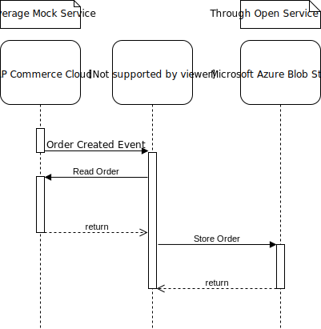

The second lambda function is exposed through an HTTPS endpoint and serves the stored order from the Azure Blob Storage.

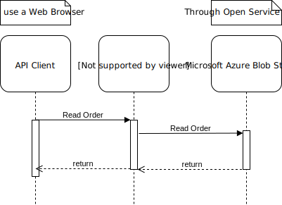

## Create Service Instance of Azure Blob Storage

In the context of your namespace go to the catalog and navigate to "Services" and search for `Azure Storage Blob Storage Account And Container`:

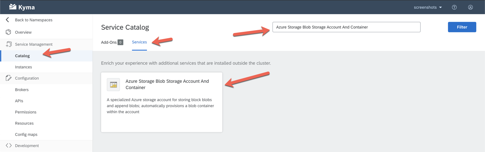

Click on the tile and select `Add`:

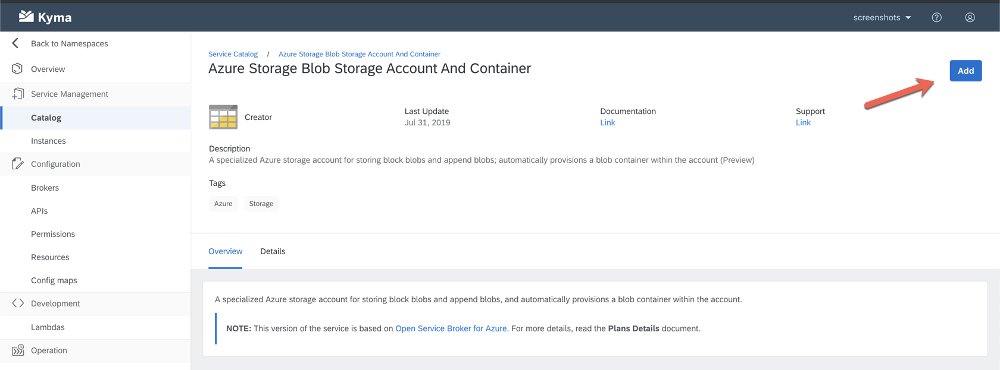

In the configuration dialog, add the following values and click `Create Instance`:

| Name          | Value         | Comment |
| ------------- | ------------- | ------- |
| Container Name    | sapteched-2019-caa383-{location}-{workplace-id} | Must be unique.
| Location      | West Europe  | Physical location of your data | 
| Resource group | sapteched-2019-caa383     | Used to group resources in Azure Account |

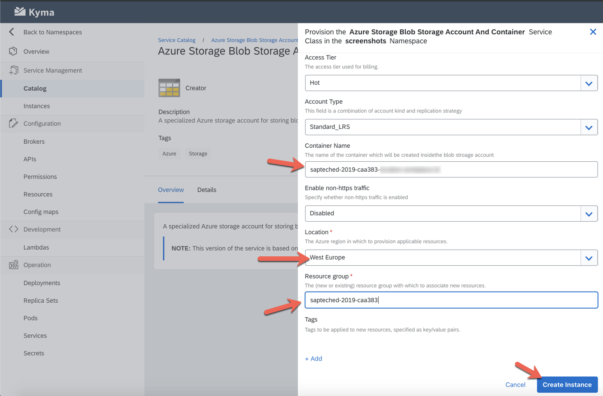

## Migrate Lambda Function to store SAP Commerce Cloud Order

Migrating the Lambda function from Google Cloud Storage to Microsoft Azure Blob Storage requires replacing libraries and storage access code. However code to interact with SAP Commerce Cloud remains unchanged.

To create the new function, go to "Lambdas" and select `Add Lambda`:


In the Lambda use the **Function Name** `store-order-azure`, **Label** `platform=azure` and then select "Select Function Trigger" `Event Trigger`:

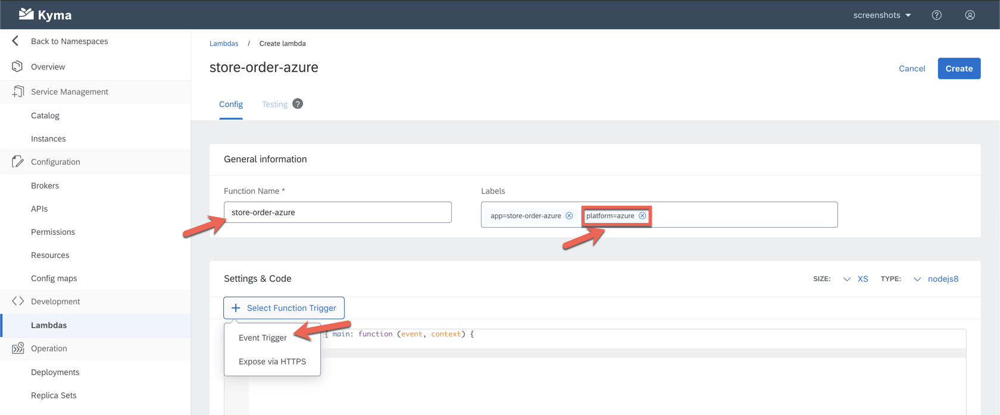

In the "Add Event Trigger" dialog, search for `order.created`. Select the matching event and click `Add`:

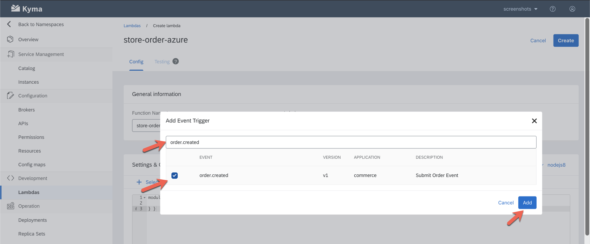

Now we need to the copy the code of the Lambda Function from [azure/store-order-azure/app.js](../azure/store-order-azure/app.js) to the maching region of the Lambda screen in the Kyma Console.


Take a moment to inspect the Lambda code and understand it. Here is the basic outline:

1. import [npm](https://docs.npmjs.com/about-npm/) packages / libraries. In this function we use [axios](https://www.npmjs.com/package/axios), a http client (to call the SAP Commerce Cloud API) and the [Azure Storage SDK V10 for JavaScript - Blob](https://www.npmjs.com/package/@azure/storage-blob) (to store the order file)
2. instantiate connection to Azure Blob Storage. This leverages the [Service Instance](#create-service-instance-of-azure-blob-storage) created earlier through a "Service Binding" which will be created later.
3. create the [node module](https://nodejs.org/api/modules.html#modules_modules) that exports a function with the signature `main: async function (event, context)`. This function will be executed whenever an `order.created` event is triggered (No changes here)
4. the function extracts the `orderCode` from the `event.data` object and then uses the SAP Commerce Cloud API through the axios http client. The url to commerce is injected through another binding which will be created later as well (No changes here)
5. In the next step the order is written as a file to the Azure Blob Storage Container created earlier using the `{orderCode}.json` value as filename. 

To make the two required dependencies available, first enable them in the Lambda UI and then copy the minimal [azure/store-order-azure/package.json](../azure/store-order-azure/package.json) to the area shown in the below screenshot:

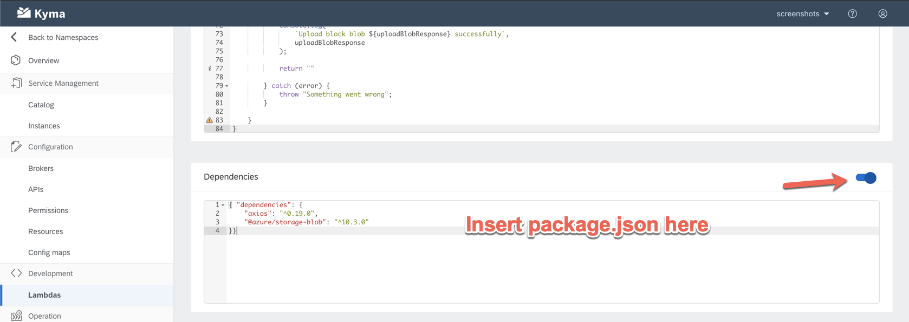

Now you create the binding to the previously created SAP Commerce Cloud Web Services Instance. This remains unchanged. To do this, click on `Create Service Binding`. Select the `sap-commerce-cloud-commerce-webservices-{random name}` instance from the dropdown and then select `Create Service Binding`.


Now you can also bind the function to the previously created Azure Blob Storage Container. This is different from the Google Instance which required additional configuration and hence could not be done from within the Lambda UI.

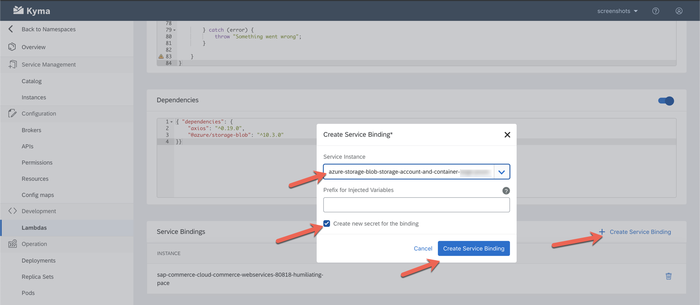

After that scroll back up and select `Create` to create/save the serverless function:

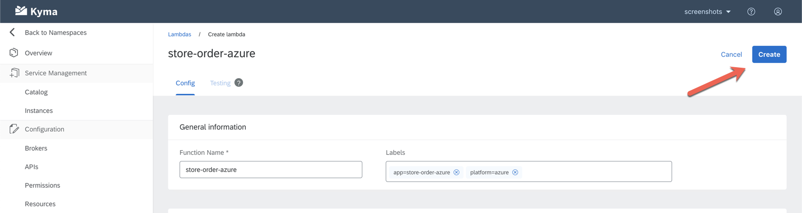

Now you can test the function.


## Test Lambda Function to store SAP Commerce Cloud Order

To enable testing, you need to temporarily expose the function via https. To do so, go to the Lambda screen, in the "Select Function Trigger" menu choose `Expose via HTTPS`. Then Disable Authentication and click `Àdd`.


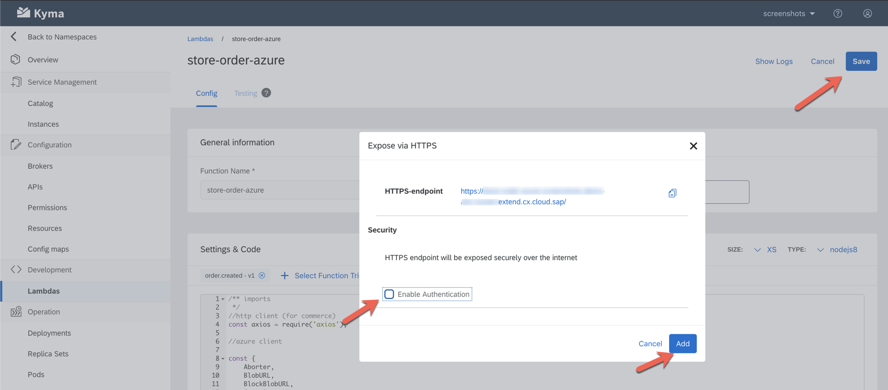

This enables the Kyma Console UI to simulate the event without going through the [Kyma Eventing infrastructure](https://kyma-project.io/docs/components/event-bus/).

After Saving the Lambda Function. you can switch to the Testing Tab. Here you have to select the `order.created` event from dropdown in the upper right part of the screen. This will generate a sample payload where you can adapt the `orderCode` value. Pressing `Make a test call` will execute the Lambda Function.

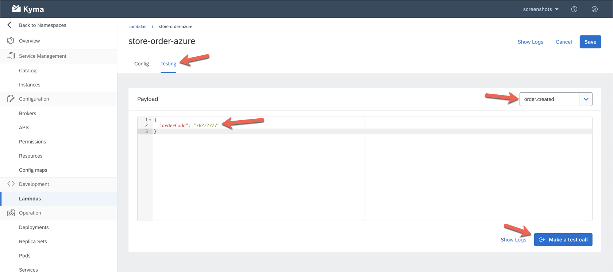

After Testing the Lambda you can inspect the logs and check whether the call was successful:

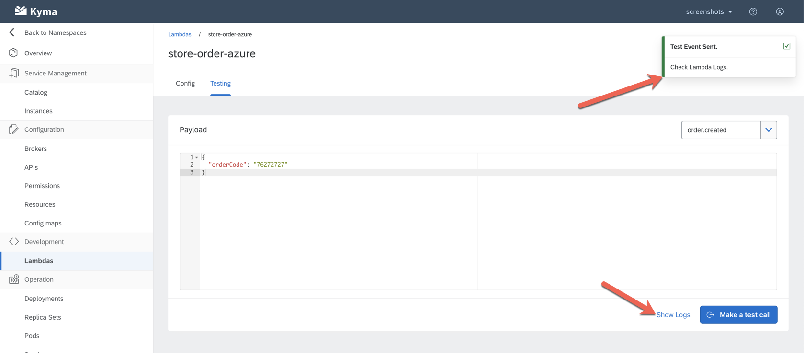
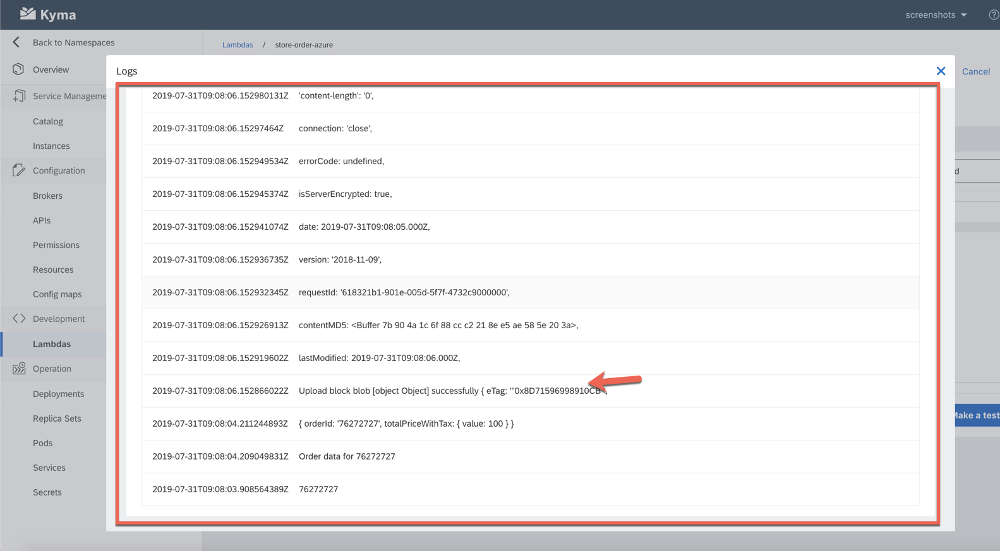

Before exiting, disable the http exposure by removing the "http" tag from the triggers.

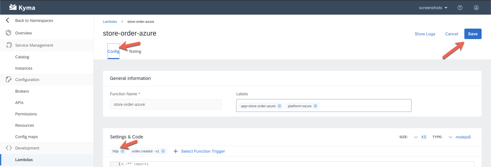

## Create Lambda Function to read SAP Commerce Cloud Order

To migrate the second Lambda, go to "Lambdas" and select `Add Lambda`:


In the Lambda use the **Function Name** `read-order-azure`, **Label** `platform=azure` and then select "Select Function Trigger" `Expose via HTTPS`:

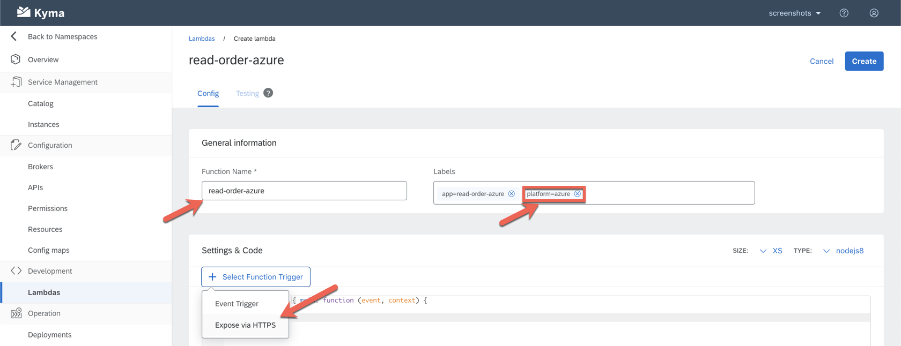

In the "Expose via HTTPS" dialog, disable Authentication and click `Add`:

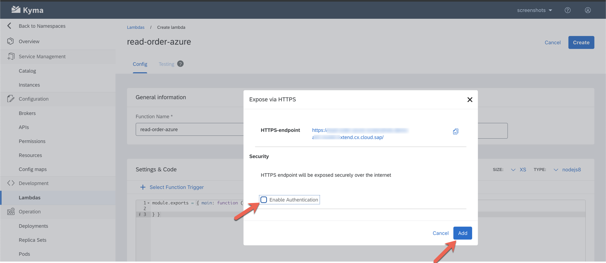

Like before, we have ensured that the Lambda Function will be executed whenever the new "HTTPS enpoint is called". Now we need to copy the code of the Lambda Function from [azure/read-order-azure/app.js](../azure/read-order-azure/app.js) to the matching region of the Lambda screen in the Kyma Console.


Take a moment to inspect the Lambda code and understand it. Here is the basic outline:

1. import [npm](https://docs.npmjs.com/about-npm/) packages / libraries. In this function we use the [Azure Storage SDK V10 for JavaScript - Blob](https://www.npmjs.com/package/@azure/storage-blob) (to read the order file)
2. instantiate connection to Azure Blob STorage. This leverages the [Service Instance](#create-service-instance-of-azure-blob-storage) created earlier, through a "Service Binding" 
3. create the [node module](https://nodejs.org/api/modules.html#modules_modules) that exports a function with the signature `main: async function (event, context)`. This function will be executed whenever an HTTPS call is received (No change to this code)
4. the function extracts the `orderCode` from the `orderCode` query parameter which is passed as one of the extension parameters of the `event.data` object (No change to this code)
5. In the next step the order is read from a file on the associated Azure Blob Storage Container and returned as HTTP response.

To make the required dependency available, first enable dependencies in the Lambda UI and then copy the minimal [azure/read-order-azure/package.json](../azure/read-order-azure/package.json) to the area shown in the below screenshot:


Now you create the service binding. Select `Create Service Binding`. Leave `Create new secret for the binding` enabled. Select the existing Service Instance for Azure Blob Storage and select the previously created secret from the `Secrets` dropdown. Press `Create Service Binding`.

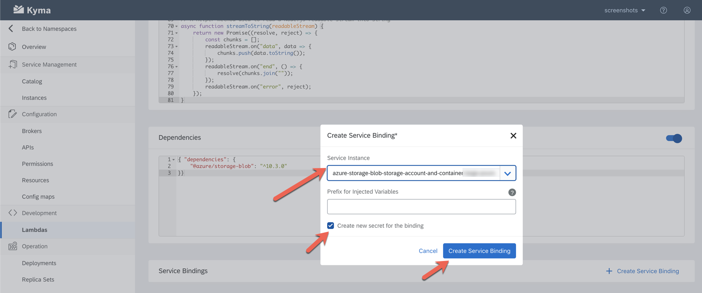

Now you can scroll up and create the Lambda Function. 

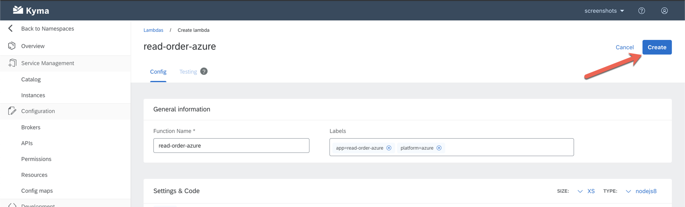

The Lambda will take a bit to be fully active, so have a bit of patience before you start testing (around one minute).

## Test Lambda Function to read SAP Commerce Cloud Order

As this function is exposed via HTTPS, any Internet Browser is enough to test it. To acquire the endpoint address of your Lambda, hover over the http trigger and copy the the url to clipboard.

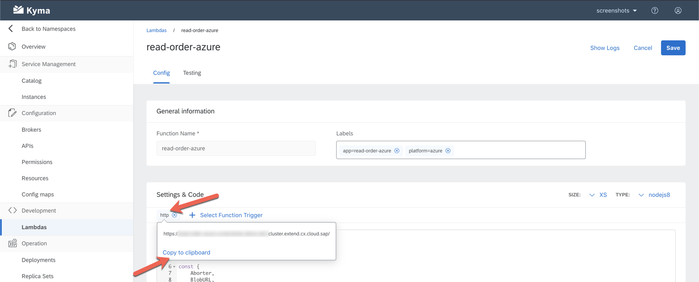

Now you can add the `?orderCode={your previously provided order code}` postfix to the copied url. If you don't remember, you can repeat the steps in [testing the store Lambda](#test-lambda-function-to-store-sap-commerce-cloud-order). Your url should look like the one below:

```
https://read-order-azure.mycluster.cluster.extend.cx.cloud.sap/?orderCode=76272727
```

Calling this url in a browser should result in an output similar to the one below:


If you don't provide an `orderCode`, the response looks as follows:


Should the order code be invalid, there this error (however, as it is pretty generic the root cause might be different):


## Conclusion

Whilst the Kyma Serverless/Lambda environment works the same accross Google Cloud Platform and Microsoft Azure, the backing services offer similar functional capabilities with different APIs and libraries. 

This makes moving code from one hyperscaler to another difficult. However there are the following strategies that help to ease this pain:

1. Use standard/open APIs if available (e.g. use the HBase API to access [Google Cloud BigTable](https://cloud.google.com/bigtable/docs/reference/libraries))
2. Use available abstractions for proprietary APIs such as [Minio Gateway](https://github.com/minio/minio/tree/master/docs/gateway)
3. Write your own libraries to abstract from these changes

