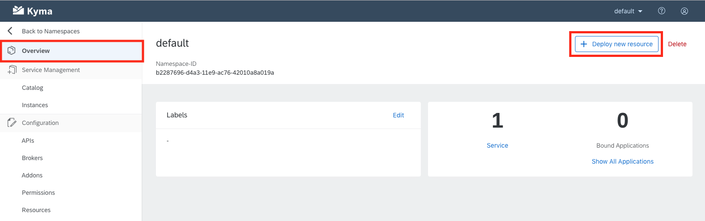
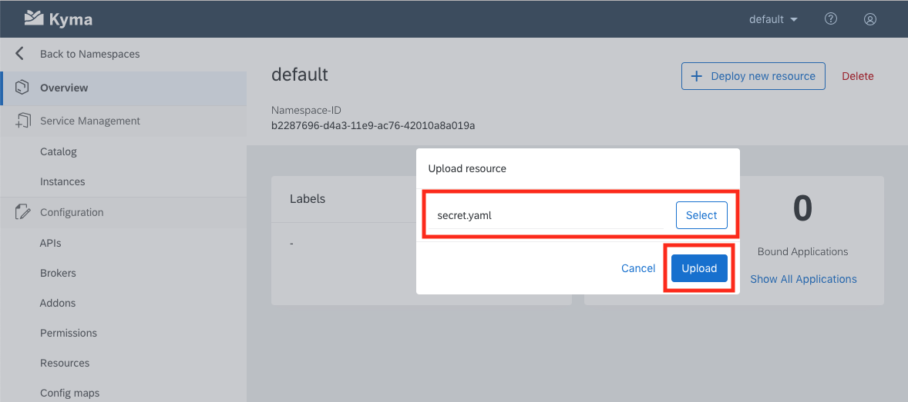
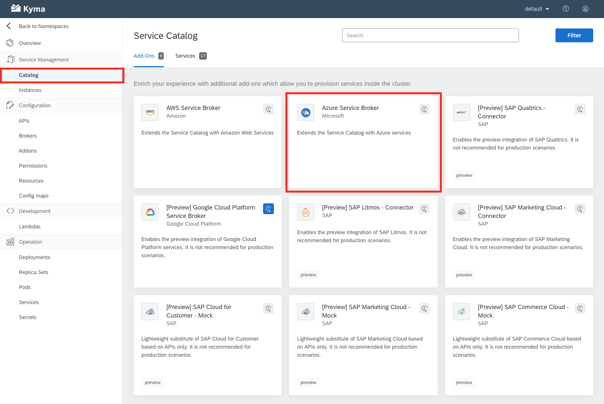
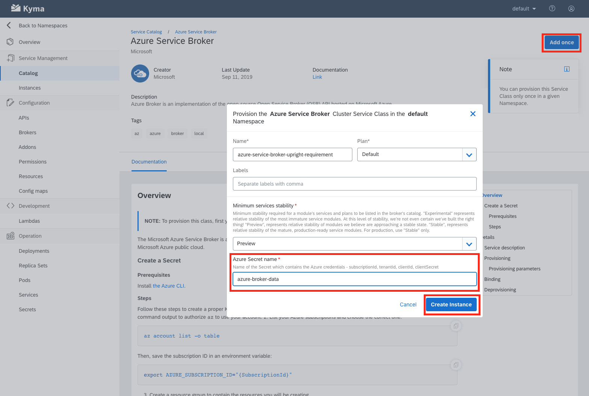

# Azure Service Broker - Configuration

## About
In this part of the session you are going to setup a service broker configuration to [Microsoft Azure](https://github.com/Azure/open-service-broker-azure/blob/master/README.md).  This will provide the resources within the namespace access to various services available on Azure, for example blob storage which we will be using in a later exercise.  

## Deploy Secret
In these steps we will deployment a Kubernetes secret file which contains the necessary authentication information to configure the Service Broker connection to Azure. The steps necessary to obtain the authentication information will have already been done by your instructor and are detailed within the Azure Service Broker - Service Catalog Tile. We will simply deploy the Kubernetes secret as apposed to generating it.

Within the context of your namespace choose the Oveview menu option and then choose Deploy new resource

The Azure Secret details will need to be populated by your instructor before you can use it. Download the secret.yaml. You have to replace the placeholder in the file. Important: project-name and sa-key need to be base64 encoded (https://www.base64encode.org/). Then upload the secret to your instance by choosing the Select button and navigating to where you have it saved. Choose the Upload button when complete.

## Create the Service Instance

Within the context of your namespace choose the `Catalog` menu option and then choose `Azure Service Broker`

Choose the `Add once` button and provide the Azure Secret name and finally choose `Create Instance`

`Azure Secret name:  azure-broker-data`

