# Storage & Retrieval of a SAP Commerce Cloud Order with Google Cloud Platform

## About

In this part of the session you are going to subscribe a [serverless Lambda Function](https://kyma-project.io/docs/components/serverless/) to the Order Created event of SAP Commerce Cloud (represented by an already existing [Mock service](https://github.com/SAP/xf-application-mocks/tree/master/commerce-mock) and persist the order on Google Cloud Storage. After receiving the event, the order is queried and persisted in the storage bucket. The cloud storage is provisioned using the [Kyma Service Catalog](https://kyma-project.io/docs/components/service-catalog/). 

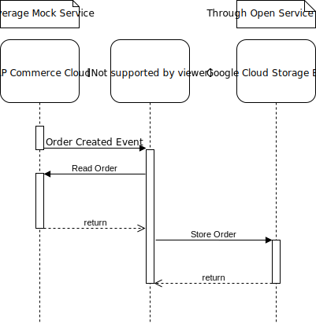

After storing the order you are going to create a second lambda function that is exposed through an HTTPS endpoint which serves the stored order from the storage Bucket.

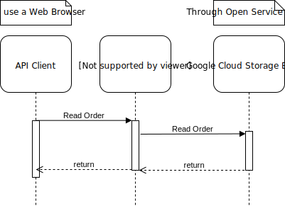

## Create Instance of SAP Commerce Cloud API and Event

In the context of your namespace go to the catalog and navigate to "Services" and search for `SAP Commerce Cloud - Events`:

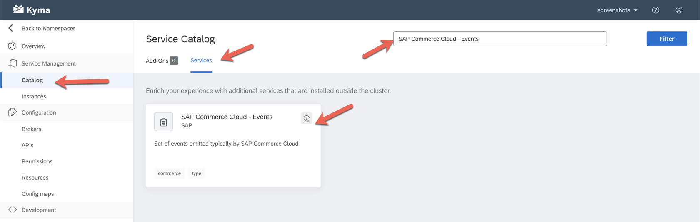


Click on the tile and select `Add once`:

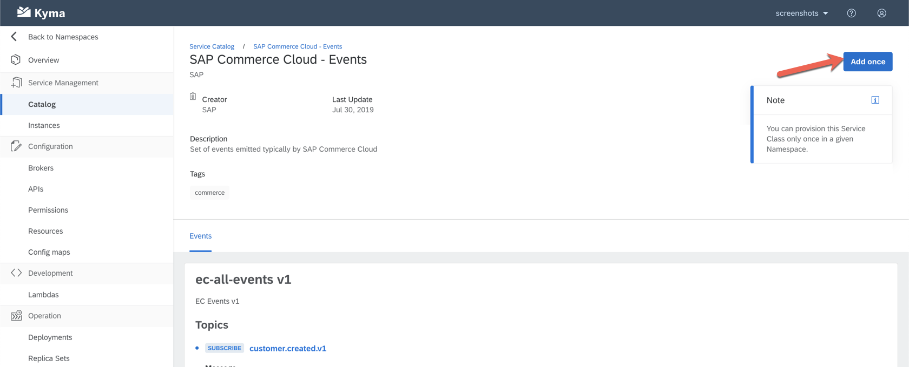

Leave defaults and click `Create Instance`:

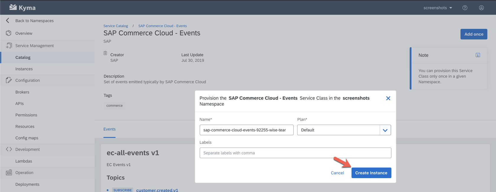

Now repeat the same steps for the `SAP Commerce Cloud - Commerce Webservices`:


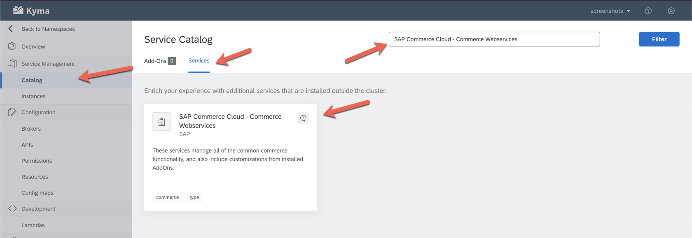

## Create Service Instance of Google Cloud Storage

In the context of your namespace go to the catalog and navigate to "Services" and search for `Google Cloud Storage`:


Click on the tile and select `Add`:

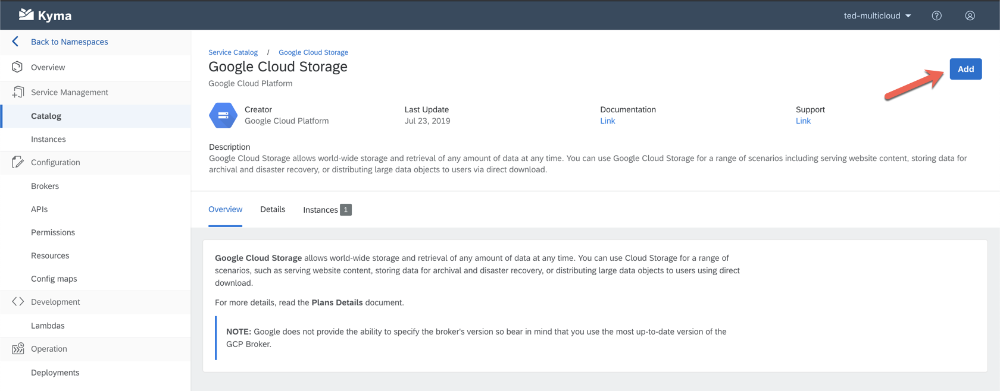

In the configuration dialog, add the following values and click `Create Instance`:

| Name          | Value         | Comment |
| ------------- | ------------- | ------- |
| Plan          | regional      | Storage will only be in one GCP region (like the cluster itself)|
| Force Delete  | true | when deleting contents will be erased |
| Name     | sapteched_2019_caa383_{location}_{workplace-id} | Must be globally unique accross Google Cloud. |
| Location      | europe-west1 | Physical location of your data | 

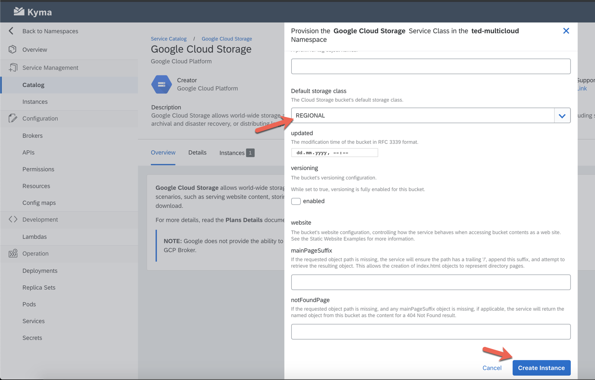

## Create Lambda Function to store SAP Commerce Cloud Order

The Lambda Function is home to the actual extension logic. It is written in [Node.js 8](https://nodejs.org/en/download/releases/). Lambda Functions let developers focus on the business logic alone and delegate frequent challenges such as packaging the code (into a [container](https://en.wikipedia.org/wiki/Docker_(software) or anything equivalent), scaling it to accomodate the to the current load to the underlying serverless framework.

In the Kyma runtime, a Lambda Function is best created from the [Console UI](https://kyma-project.io/docs/components/console). For this go to "Lambdas" and select `Add Lambda`:

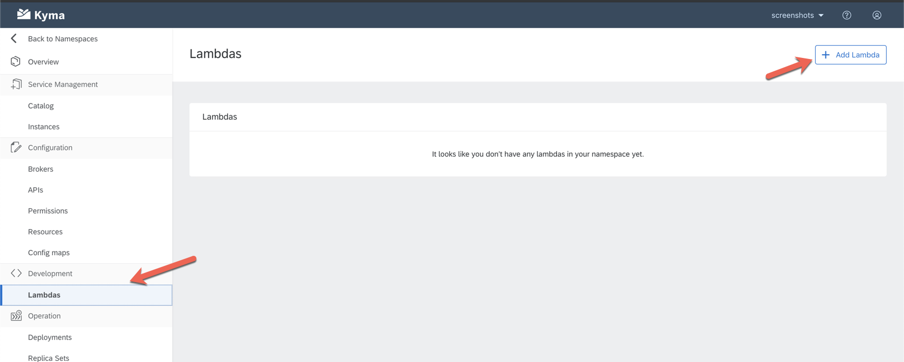

Every Lambda function requires a unique name (within the namespace). To group ([Kubernetes](https://kubernetes.io/docs/concepts/overview/working-with-objects/labels/)) artefacts together, Labels are used. This allows us to manage the lifecycle of many objects togeteher. 

In the Lambda use the **Function Name** `store-order-gcs`, **Label** `platform=gcp` and then select "Select Function Trigger" `Event Trigger`:

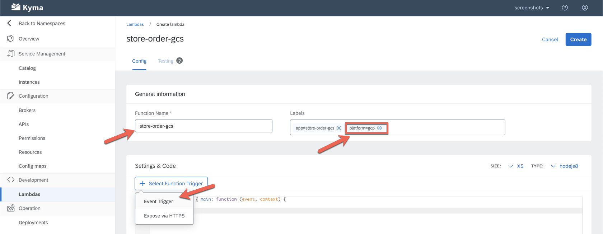

In the "Add Event Trigger" dialog, search for `order.created`. Select the matching event and click `Add`:

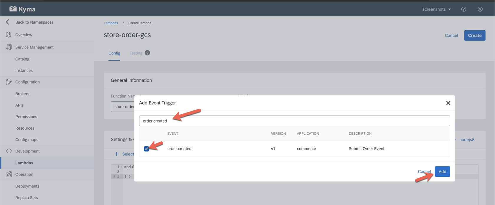

With this we have ensured that the Lambda Function will be executed whenever an order is created in SAP Commerce Cloud. Now we need to the copy the code of the Lambda Function from [gcp/store-order-gcs/app.js](../gcp/store-order-gcs/app.js) to the maching region of the Lambda screen in the Kyma Console.

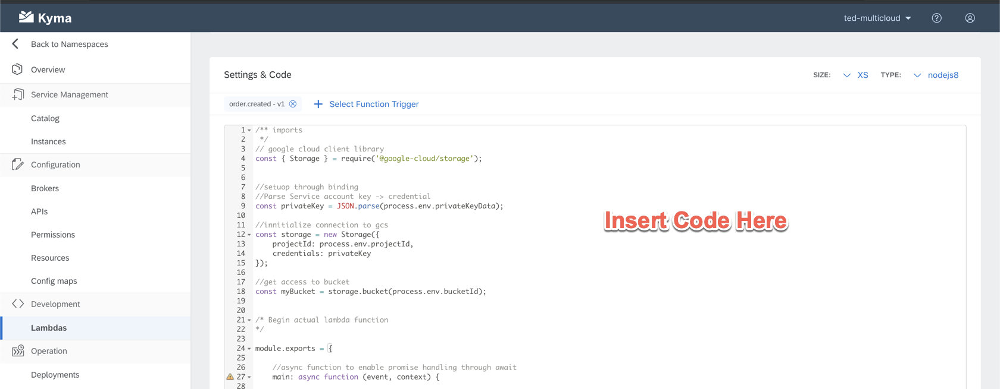

Take a moment to inspect the Lambda code and understand it. Here is the basic outline:

1. import [npm](https://docs.npmjs.com/about-npm/) packages / libraries. In this function we use [axios](https://www.npmjs.com/package/axios), a http client (to call the SAP Commerce Cloud API) and the [Google Cloud Storage Library](https://www.npmjs.com/package/@google-cloud/storage) (to store the order file)
2. instantiate connection to Google Cloud Storage. This leverages the [Service Instance](#create-service-instance-of-google-cloud-storage) created earlier through a "Service Binding" which will be created later. A "Service Binding" injects parameters and credentials to access the created service instance and hence makes the code portable (all you need to do is replace the binding if the code is moved to another environment)
3. create the [node module](https://nodejs.org/api/modules.html#modules_modules) that exports a function with the signature `main: async function (event, context)`. This function will be executed whenever an `order.created` event is triggered
4. the function extracts the `orderCode` from the `event.data` object and then uses the SAP Commerce Cloud API through the axios http client. The url to commerce is injected through another binding which will be created later as well
5. In the next step the order is written as a file to the Google Cloud Storage Bucket created earlier using the `{orderCode}.json` value as filename. 

To make the two required dependencies available, first enable them in the Lambda UI and then copy the minimal [gcp/store-order-gcs/package.json](../gcp/store-order-gcs/package.json) to the area shown in the below screenshot:

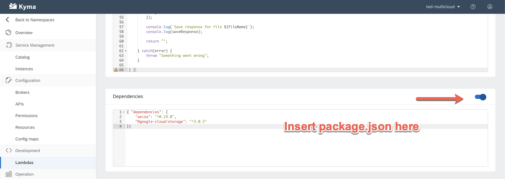

Now you create the binding to the previously created [SAP Commerce Cloud Web Services Instance](#create-instance-of-sap-commerce-cloud-api-and-event). To do this, click on `Create Service Binding`. Select the `sap-commerce-cloud-commerce-webservices-{random name}` instance from the dropdown and then select `Create Service Binding`.

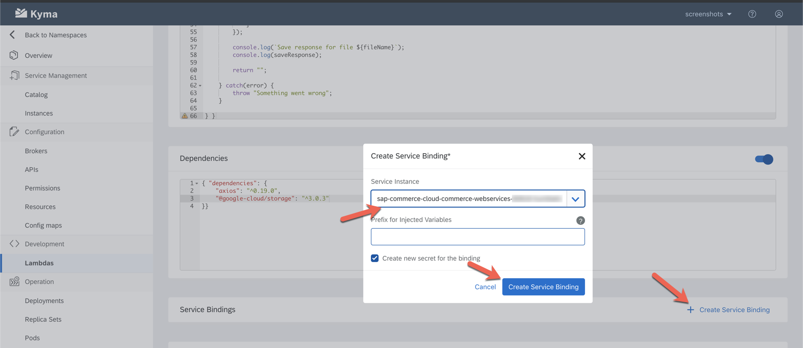

After that create the binding to the previously created [Google Cloud Storage instance](#create-service-instance-of-google-cloud-storage). Select the `google-storages-{random name}` instance from the dropdown and then select `Create Service Binding`.

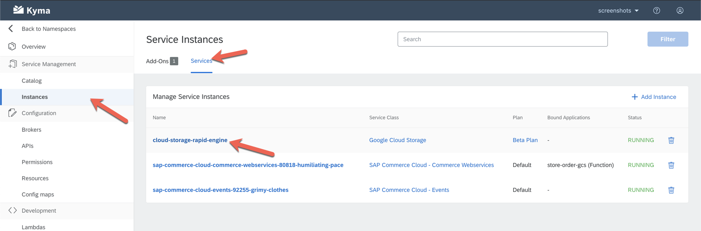

After that scroll back up and select `Create` to create/save the serverless function:

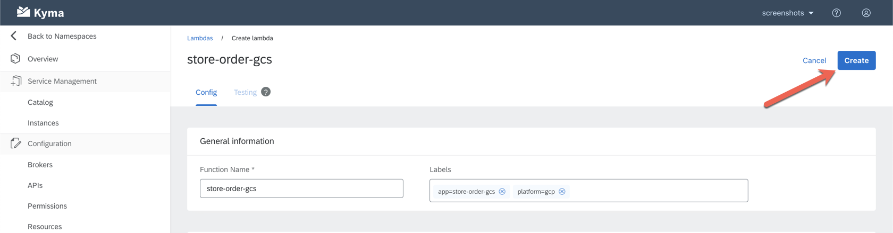

After some time the Lambda Function is ready to be tested.

## Test Lambda Function to store SAP Commerce Cloud Order

After creating the Lambda Function ist is time to validate that it works. To enable testing, you need to temporarily expose the function via https. To do so, go to the Lambda screen, in the "Select Function Trigger" menu choose `Expose via HTTPS`. Then Disable Authentication and click `Àdd`.

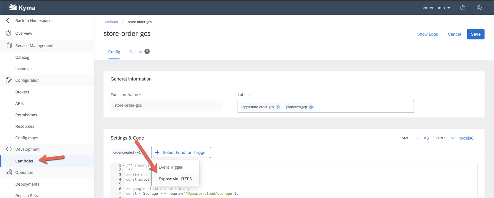
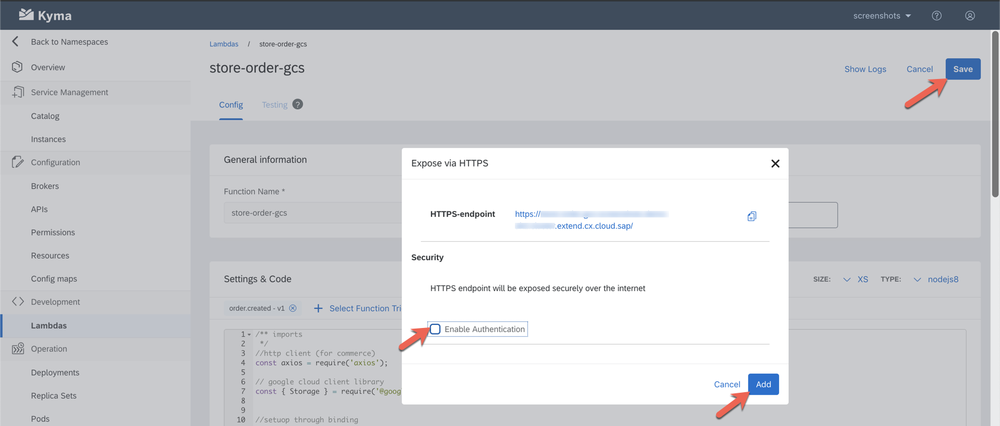

This enables the Kyma Console UI to simulate the event without going through the [Kyma Eventing infrastructure](https://kyma-project.io/docs/components/event-bus/).

After Saving the Lambda Function. you can switch to the Testing Tab. Here you have to select the `order.created` event from dropdown in the upper right part of the screen. This will generate a sample payload where you can adapt the `orderCode` value. Pressing `Make a test call` will execute the Lambda Function.

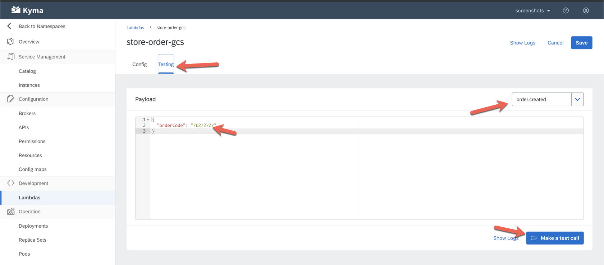

After Testing the Lambda you can inspect the logs and check whether the call was successful:

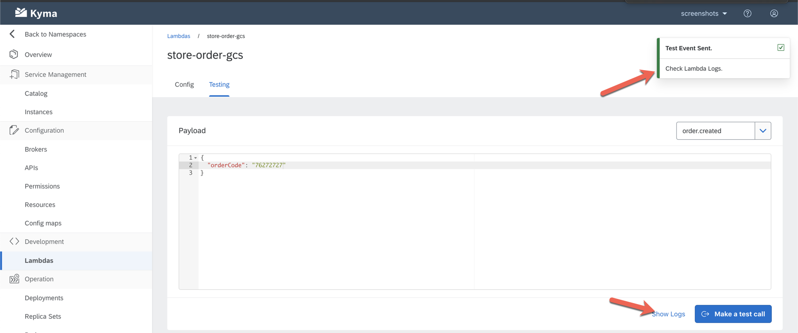
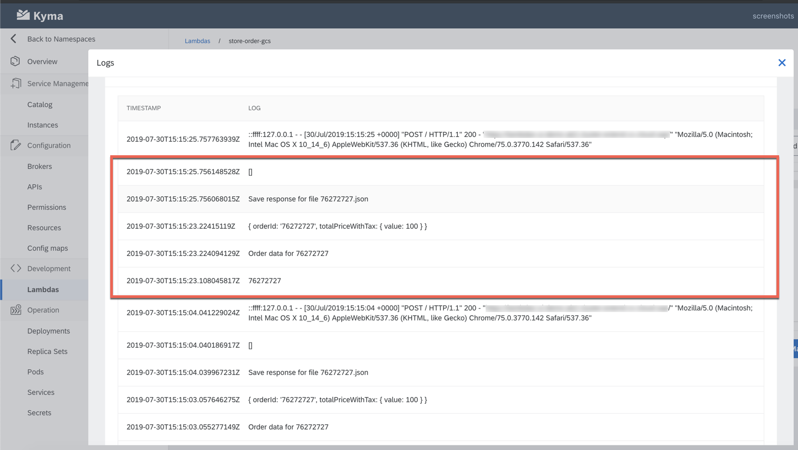

Before exiting, disable the http exposure by removing the "http" tag from the triggers.

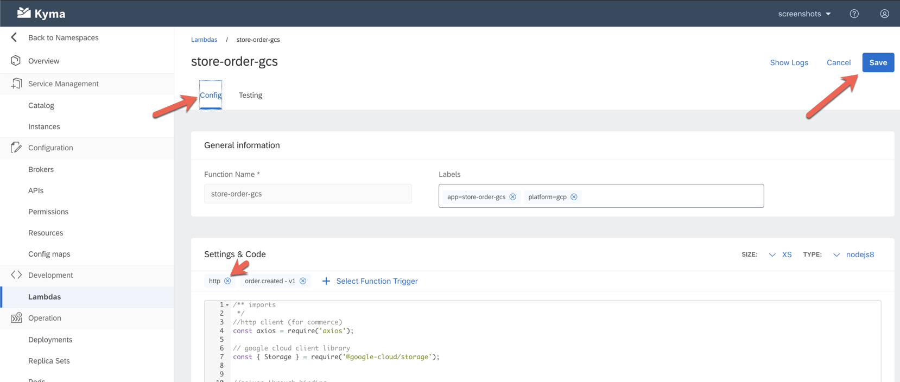

## Create Lambda Function to read SAP Commerce Cloud Order

To create the second Lambda, go to "Lambdas" and select `Add Lambda`:

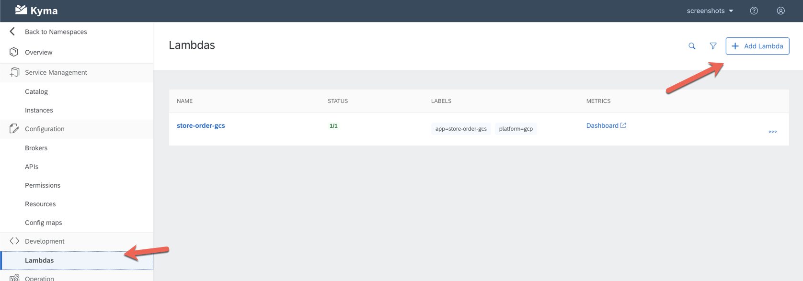

In the Lambda use the **Function Name** `read-order-gcs`, **Label** `platform=gcp` and then select "Select Function Trigger" `Expose via HTTPS`:

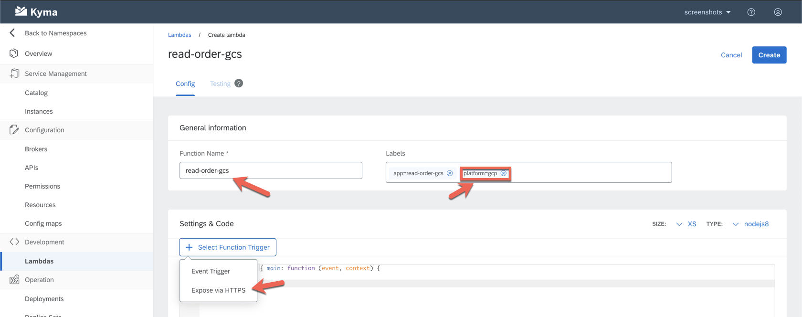

In the "Expose via HTTPS" dialog, disable Authentication and click `Add`:

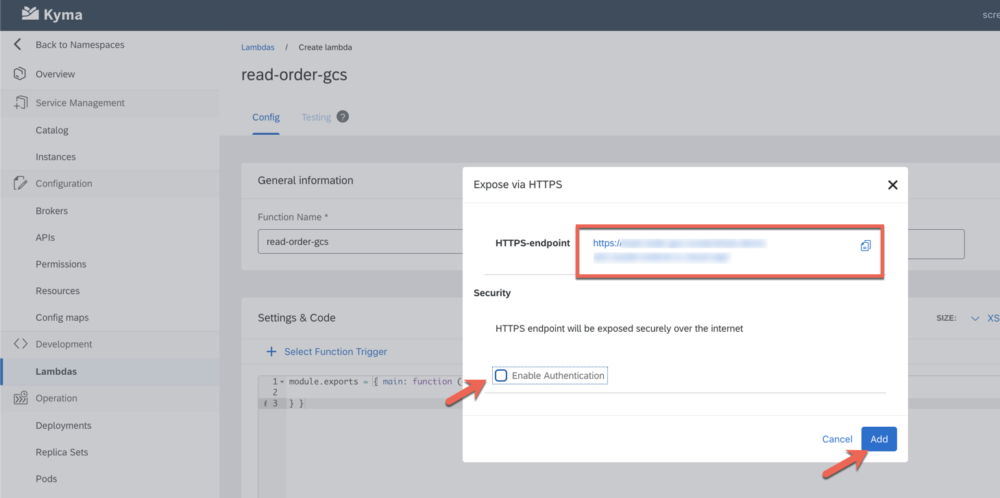

With this, we have ensured that the Lambda Function will be executed whenever the given "HTTPS enpoint is called". Now we need to copy the code of the Lambda Function from [gcp/read-order-gcs/app.js](../gcp/read-order-gcs/app.js) to the matching region of the Lambda screen in the Kyma Console.


Take a moment to inspect the Lambda code and understand it. Here is the basic outline:

1. import [npm](https://docs.npmjs.com/about-npm/) packages / libraries. In this function we use the [Google Cloud Storage Library](https://www.npmjs.com/package/@google-cloud/storage) (to read the order file)
2. instantiate connection to Google Cloud Storage. This leverages the [Service Instance](#create-service-instance-of-google-cloud-storage) created earlier, through a "Service Binding" 
3. create the [node module](https://nodejs.org/api/modules.html#modules_modules) that exports a function with the signature `main: async function (event, context)`. This function will be executed whenever an HTTPS call is received
4. the function extracts the `orderCode` from the `orderCode` query parameter which is passed as one of the extension parameters of the `event.data` object
5. In the next step the order is read from a file on the associated Google Cloud Storage Bucket and returned as HTTP response.

To make the required dependency available, first enable dependencies in the Lambda UI and then copy the minimal [gcp/read-order-gcs/package.json](../gcp/read-order-gcs/package.json) to the area shown in the below screenshot:

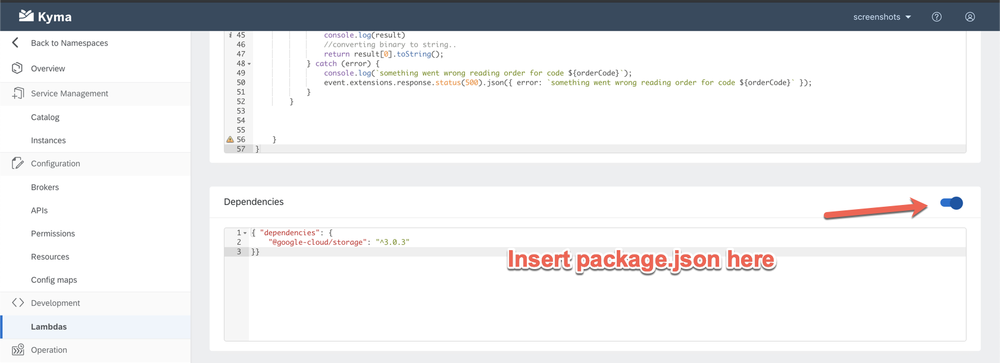

After that create the binding to the previously created [Google Cloud Storage instance](#create-service-instance-of-google-cloud-storage). Select the `google-storages-{random name}` instance from the dropdown and then select `Create Service Binding`.


Now you can scroll up and create the Lambda Function. 

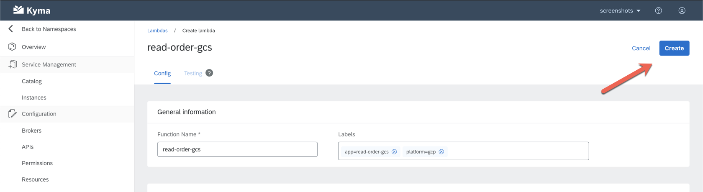

The Lambda will take a bit to be fully active, so have a bit of patience before you start testing (around one minute).

## Test Lambda Function to read SAP Commerce Cloud Order

As this function is exposed via HTTPS, any Internet Browser is enough to test it. To acquire the endpoint address of your Lambda, hover over the http trigger and copy the the url to clipboard.

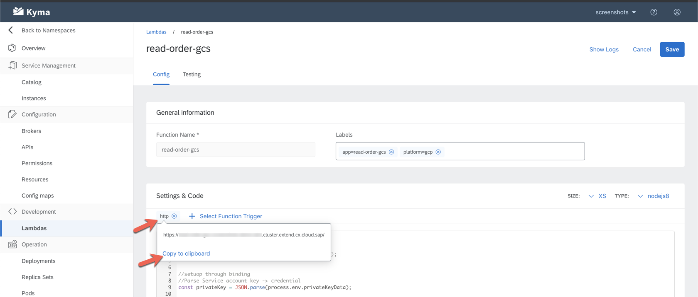

Now you can add the `?orderCode={your previously provided order code}` postfix to the copied url. If you don't remember, you can repeat the steps in [testing the store Lambda](#test-lambda-function-to-store-sap-commerce-cloud-order). Your url should look like the one below:

```
https://read-order-gcs.mycluster.cluster.extend.cx.cloud.sap/?orderCode=76272727
```

Calling this url in a browser should result in an output similar to the one below:

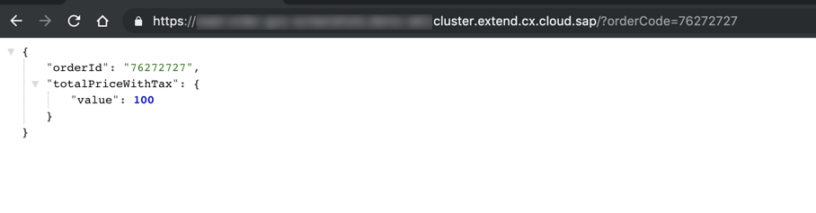

If you don't provide an `orderCode`, the response looks as follows:

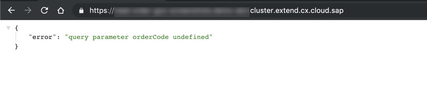

Should the order code be invalid, there this error (however, as it is pretty generic the root cause might be different):

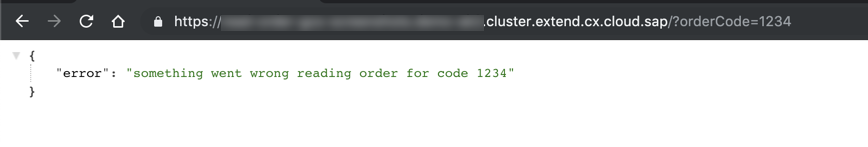
