# Setup Twitter Integration with SAP Cloud Platform - Open Connectors

## About [SAP Cloud Platform - Open Connectors](https://blogs.sap.com/2018/06/05/announcing-sap-cloud-platform-open-connectors/)
*SAP Cloud Platform(SCP) - Open Connectors* is a service offering from SCP which helps our customers seamlessly integrate and connect third party  applications by providing feature rich, pre-built connectors to over 150 non-SAP and SAP cloud or on-premise application.

## Setup 
To setup SAP Cloud Platform Open Connectors, first you need to create a trial account on SAP Cloud Platform, visit **https://cloudplatform.sap.com**

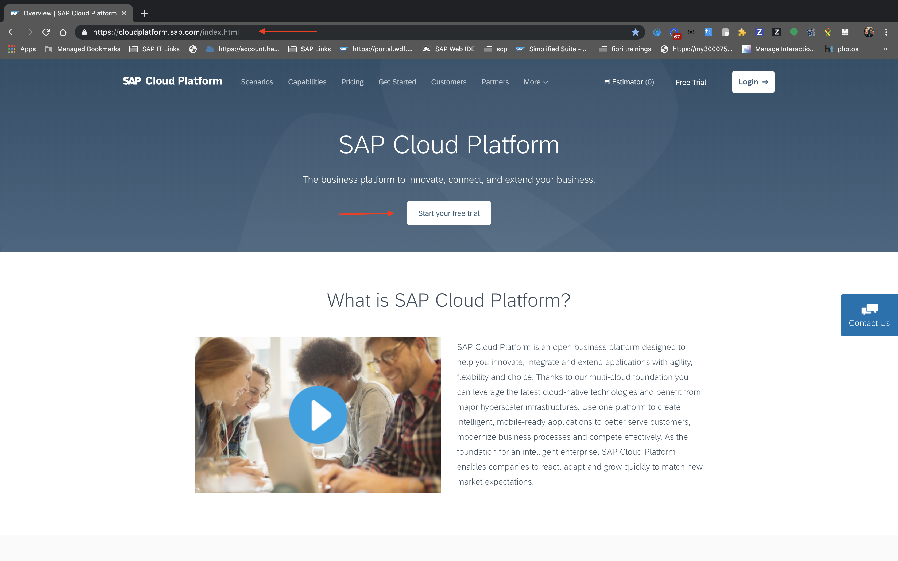

Start your free trial by clicking on the "Start your free trial" button or login to your SCP Account if you've already registered

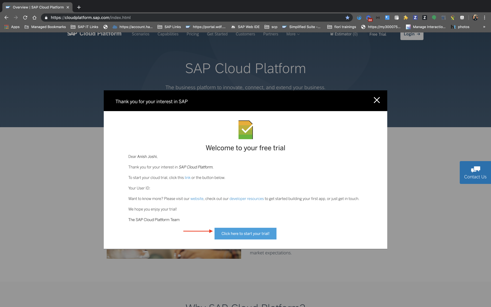

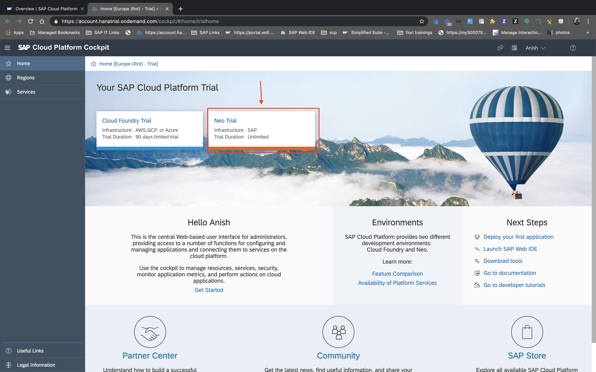

Once, you've logged into your SCP Account, you can start your neo trial from SCP Cockpit. Once you start your trial, you need to navigate to *Services* section from your subaccount overview page which would bring you to *SCP - neo Service Catalog*. And, when you arrive on the Service Catalog page, look for the *"Open Connectors"* Service and Click on it. This will bring you to Open Connectors Service Overview Page.

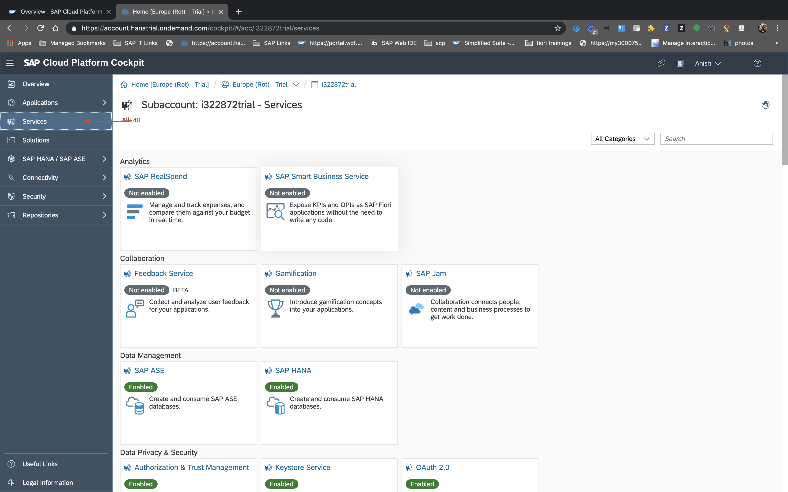


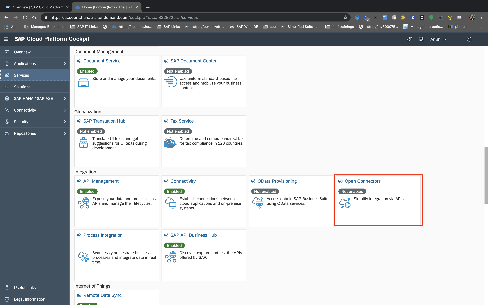

Enable the Service, if not already enabled, by clicking on the *Enable* Button. Please ensure that you don't disable this service accidentally on trial account, this will freeze the service for 72 hours, Hence, you won't be able to proceed further.

It takes a while for the service to be provisioned into your account, Once Provisioned, Navigate to the Open Connectors Service Home Page by clicking on *Go to Service* Button.


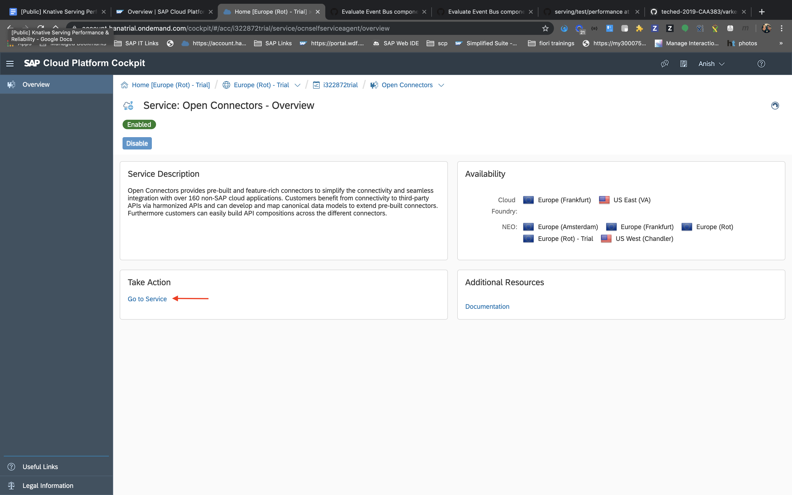

In this example, we'd create a connector for Twitter, By doing this, we can leverage twitter apis in our applications for example, tweeting about some event. To have this connection in place Navigate to the *Connectors* section from the Open Connectors Welcome Page and look for *Twitter* on the list.

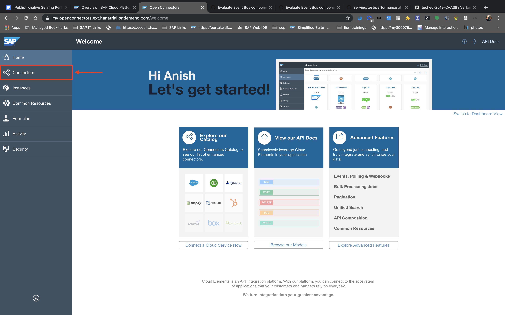


Hover on the *Twitter* tile and you can see some options appearing on the *Twitter* tile, from there click on *Authenticate*, this would give Open Connectors oAuth Access to your Twitter Account which consequently would enable Open Connectors Service to use *Twitter* APIs on your behalf.

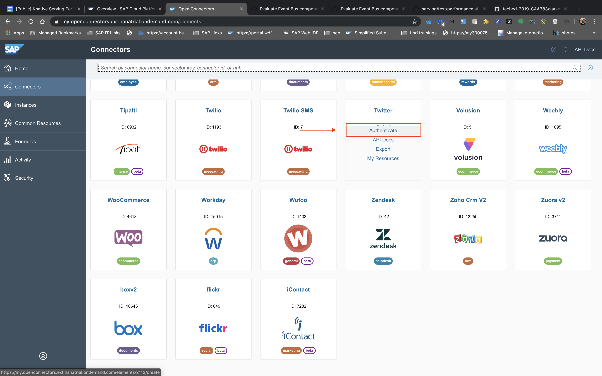

After you click *Authenticate* you'd be asked to enter name of the Connector instance, give some name and click on *Create Instance*. Now you'll be redirected to twitter login page, where you can give your Twitter credentials and proceed.

After successfull authentication to *Twitter*, you'd be requested to grant *Cloud Elements* necessary authorization to use your account.

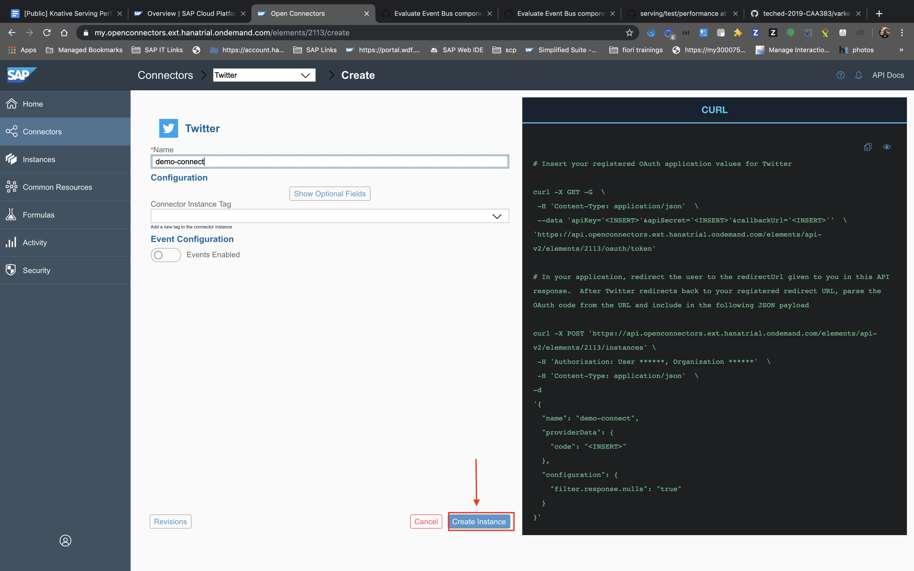

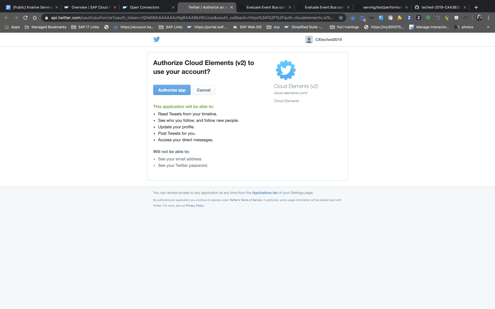

 Once you authorize *Cloud Elements*, you'll be brought back to *SCP - Open Connectors* Page, where you can test the connection by clicking on *Test in the API docs* tile.

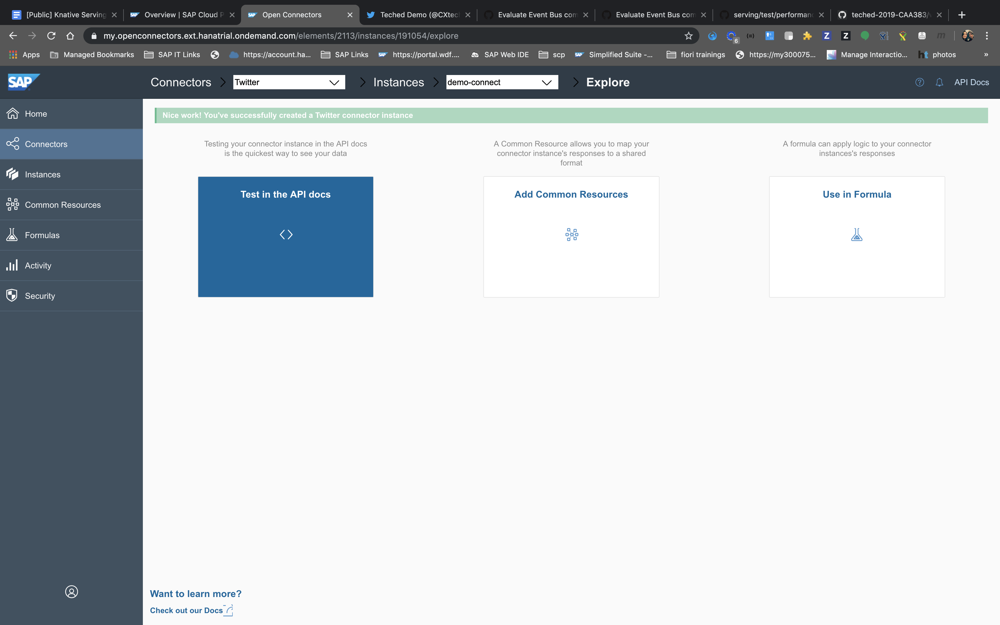

To tweet something on Twitter, you need to fire a POST request on *statuses* API. Expand the *statuses* API in  the API docs and click on *Try it out*. Once you click on *Try it out* button a text area would be made available to you, where you can supply the json payload. Simply enter:

```json
{
    "status": "Hello, World!"
}
```
 And Click on *Execute*. Check for response code, if it's *200* then you should be able to see the tweet on your Twitter Profile.

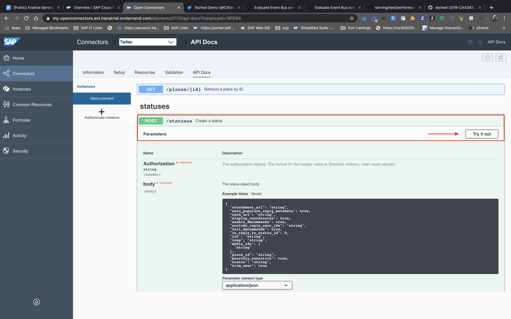

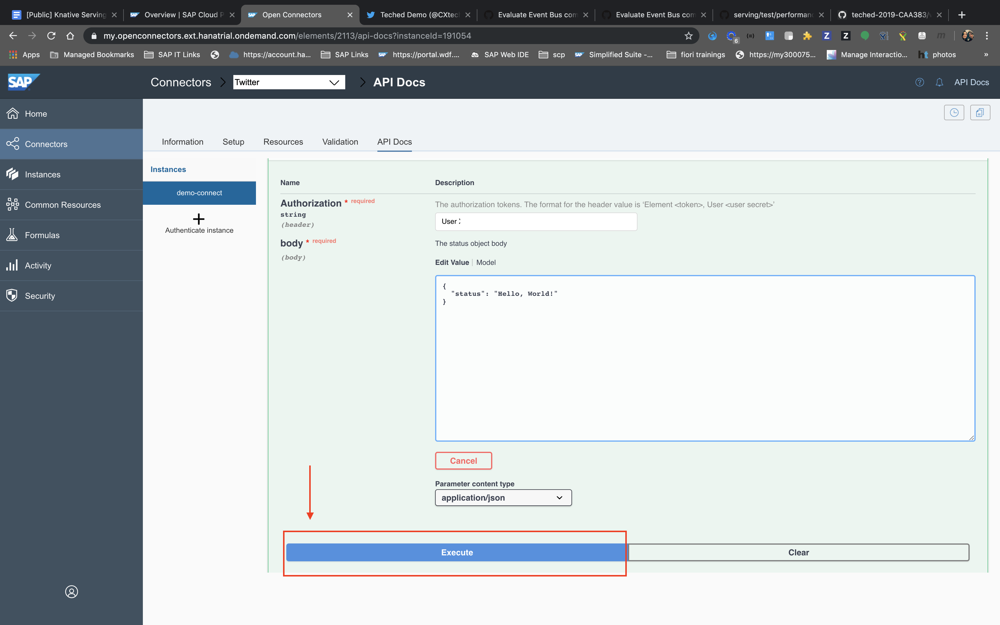

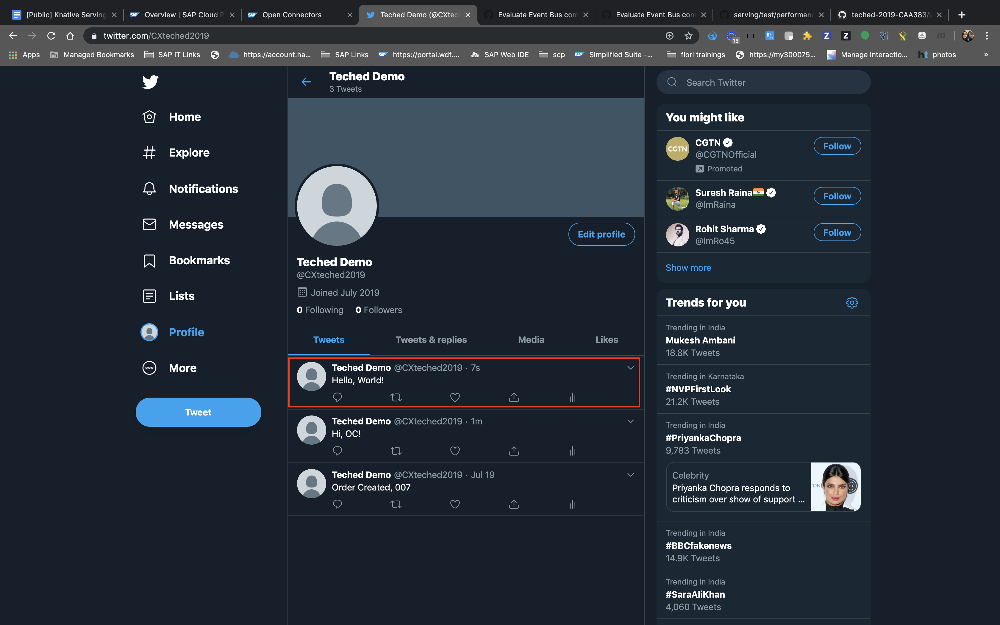

With this you have successfully created an SAP Cloud Platform - Open Connectors instance. To leverage this connection further in *kyma*, Please ensure to note down your ***Organization Secret*** and ***User Secret***

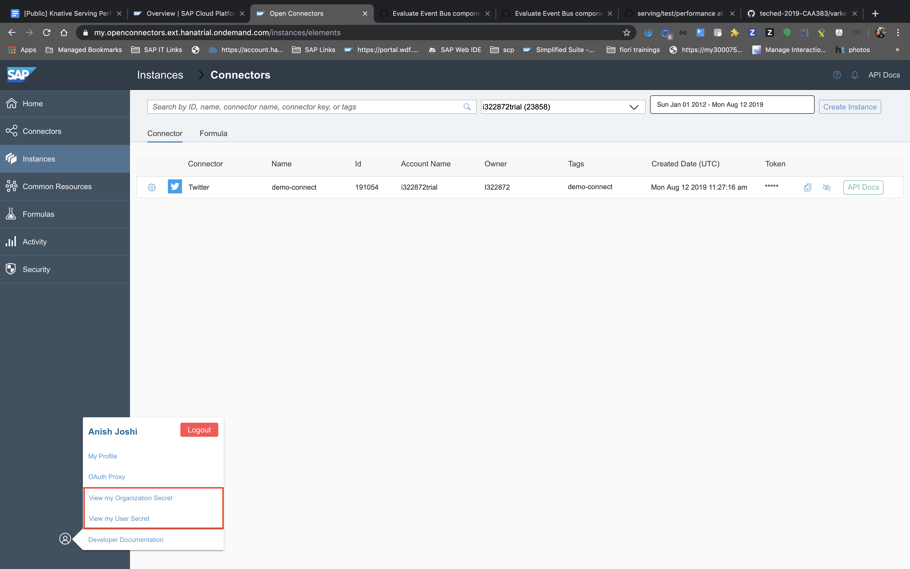