# Installing Varkes

To install Varkes, first go to [XF Application Mocks](https://github.com/SAP/xf-application-mocks) and download `xf.yaml` under the path `xf-application-mocks/commerce-mock/deployment`:

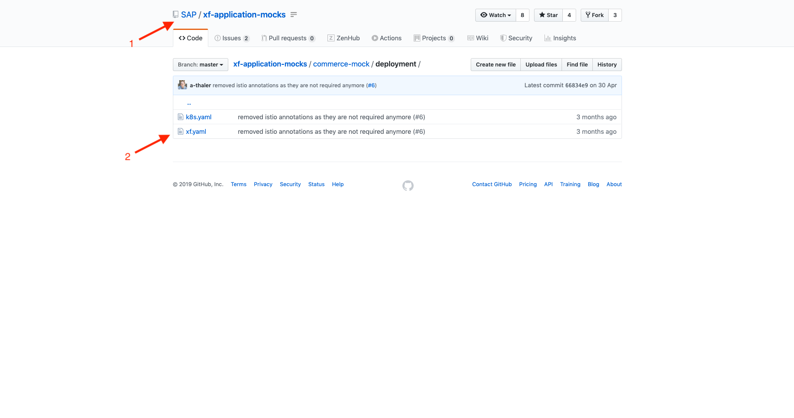

Open Kyma Console and from `Select Namespace` section, click on `Create New Namespace`. Fill the name field and create a Namespace:

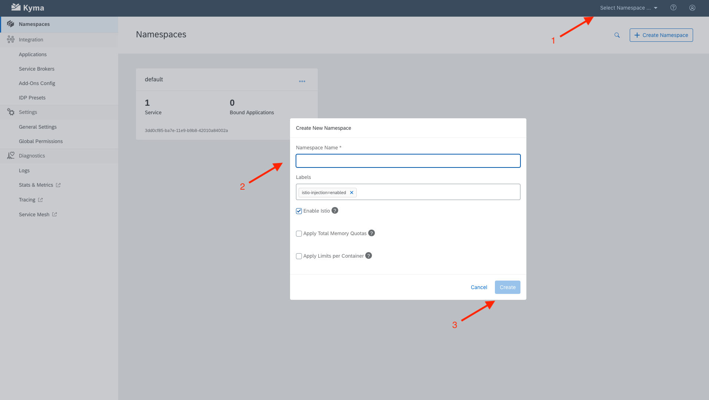

Go to the Namespace and click on `Deploy new resource`. Choose `xf.yaml` file location you downloaded earlier and click on `Upload`, so Varkes will be deployed.

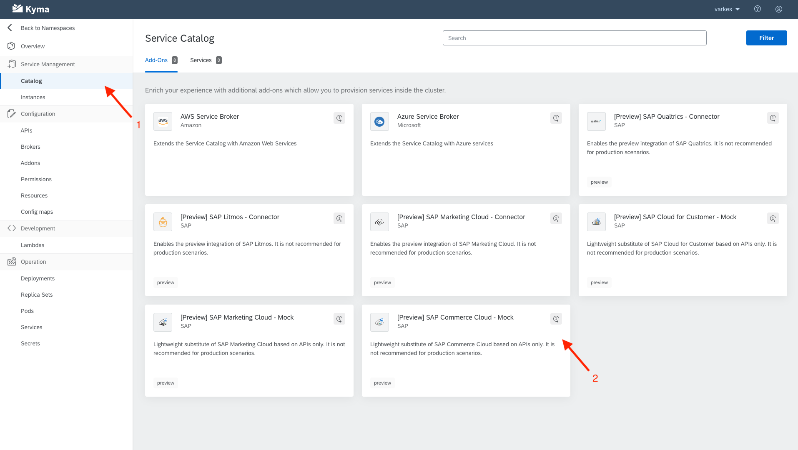

Go to Kyma homepage and choose `Applications`. Click on `Create Application` and fill the `Name` and `Description` fields to create an application:

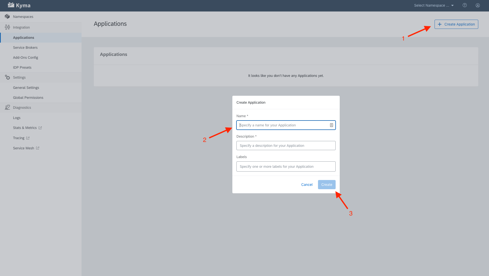

Choose the created application from the list and click on `Create Binding` from the `Namespace Bindings` section. Choose the namespace you created earlier and create the binding:

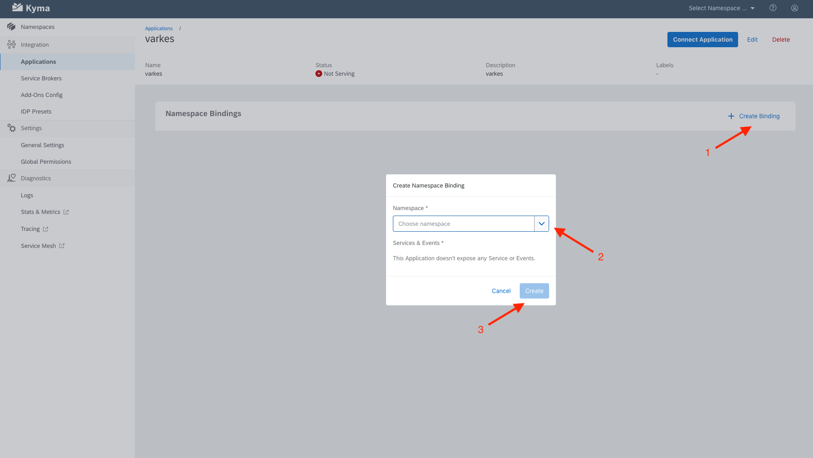

Click on `Connect Application`. This will generate a URL which will be feeded to Varkes to establish the connection between Varkes and Kyma. Copy the URL to the clipboard:

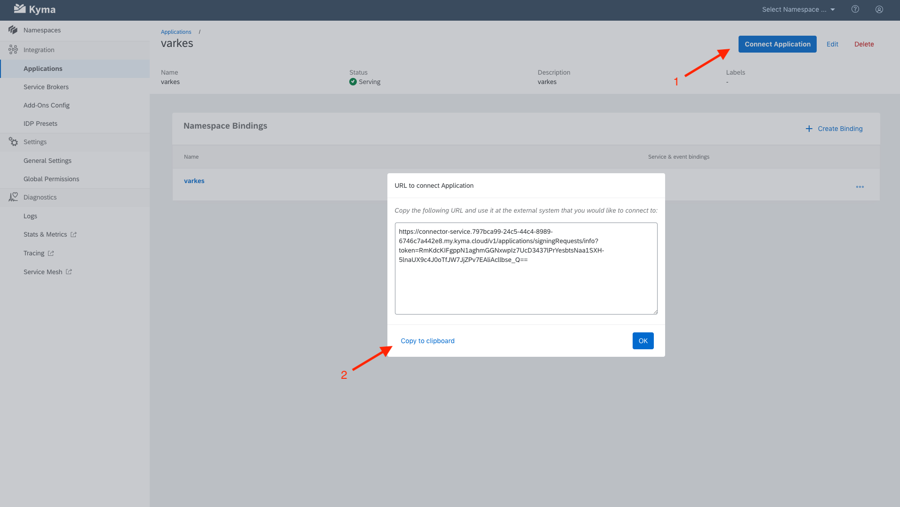

Click on `APIs` and then the hostname of the `commerce-mock` application to access Varkes:

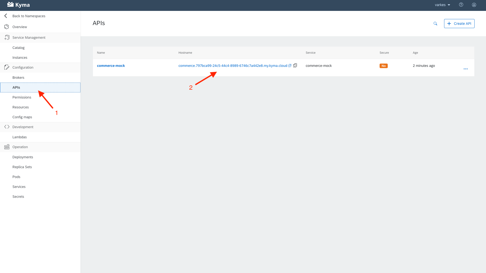

From Varkes homepage, click on Connect:

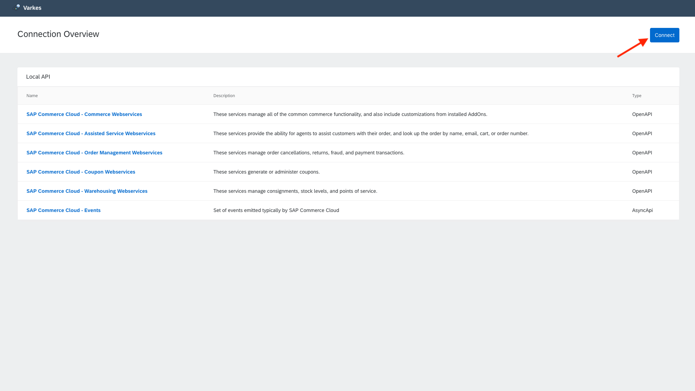

Paste the URL you copied earlier and click on `Connect` to establish the connection:

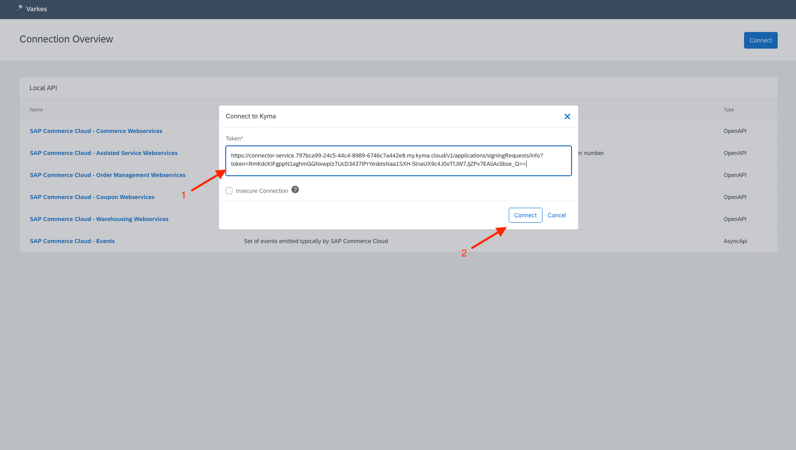

Now the status should be `Connected`. Click on `Register` for `SAP Commerce Cloud - Events`:

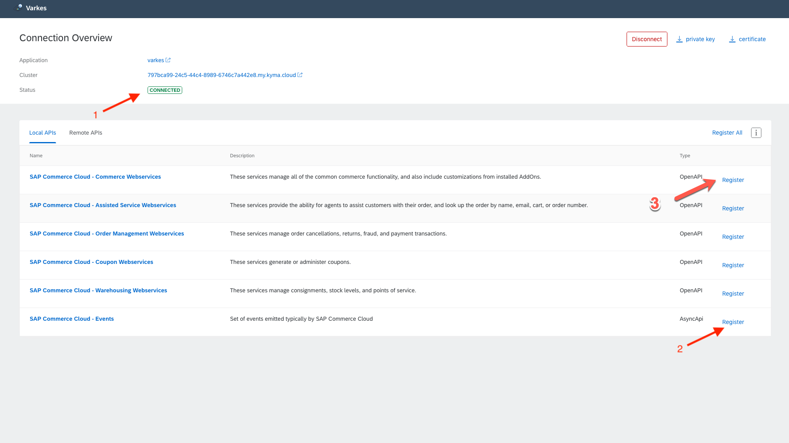

Go back to the `Applications` page on Kyma. Status of `varkes` should be `Serving` now:

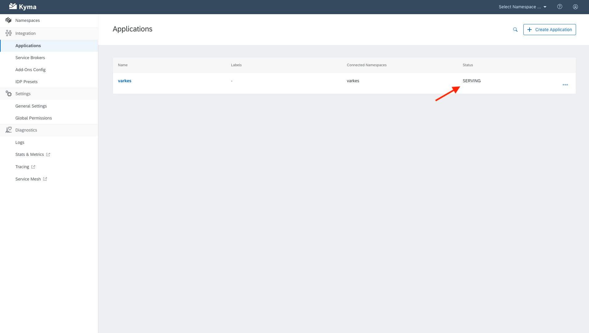